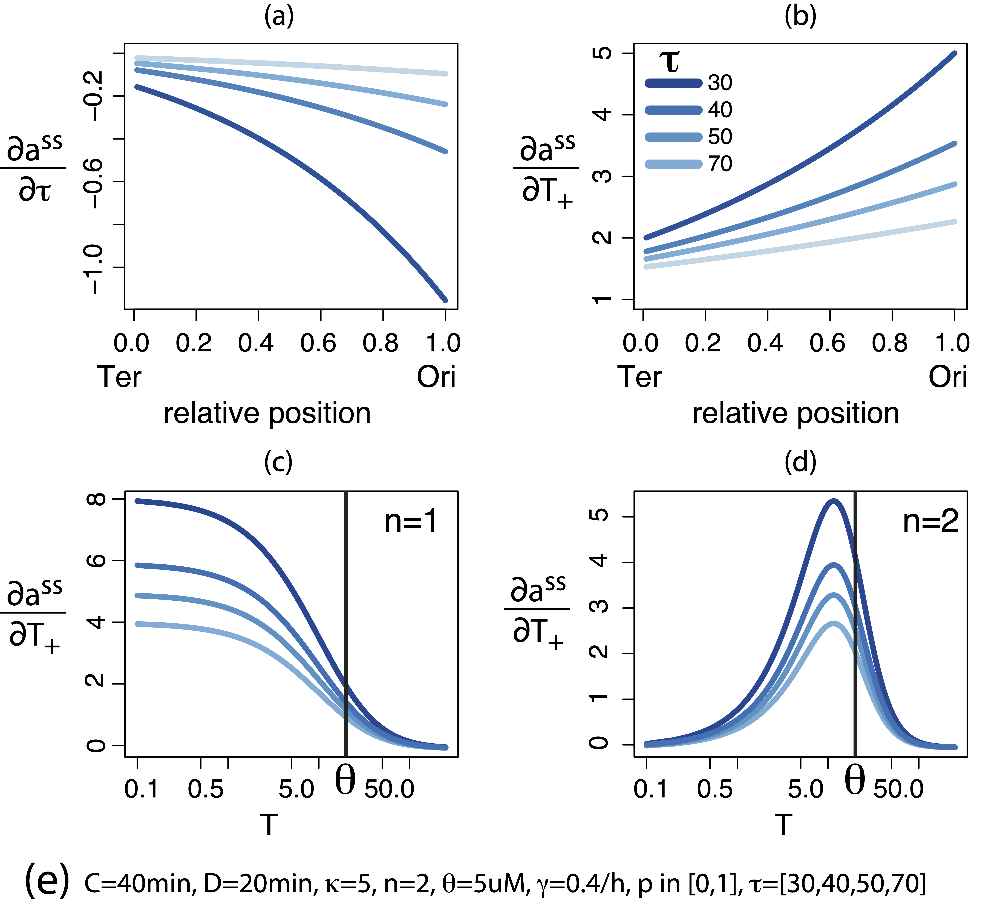

# Welcome to the Comparative Systems Biology Lab!
{: .display-4}
 
We are part of the [Department of Biosciences](https://eng.dbs.unimi.it/ecm/home), 
of the [University of Milan](https://www.unimi.it/en).
{: .welcomefont}

{:style="max-width: 40%; height: auto;"}

Research in the lab is focused on the integration of Systems Biology and Comparative genomics, to enrich our understanding of evolutionary processes.
{: .welcomefont}

We are located at the Biosciences Department of the University of Milan (Via Celoria 26, Milan), Tower A, ground floor.
{: .welcomefont}
